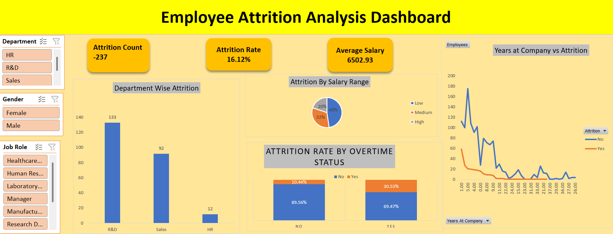

# HR Attrition Analysis Dashboard

## Project Overview

This project analyzes employee attrition patterns using Microsoft Excel.
The goal is to identify factors that contribute to employee turnover and provide insights that can help organizations improve employee retention.

## Tools Used

* Microsoft Excel
* Pivot Tables
* Pivot Charts
* Excel Formulas (IF, COUNTIF, AVERAGE)
* Slicers
* Dashboard Design

## Dataset

The dataset contains HR employee information including:

* Employee ID
* Age
* Gender
* Department
* Job Role
* Monthly Income
* Years at Company
* Overtime Status
* Attrition Status

## Key Dashboard Features

### Attrition Rate

Shows the percentage of employees who have left the company.

### Attrition by Department

Identifies departments with the highest employee turnover.

### Attrition by Salary Range

Analyzes whether lower salary groups have higher attrition.

### Overtime Impact

Examines how overtime affects employee retention.

### Attrition by Experience

Analyzes how years at company influence attrition rates.

### Interactive Filters

Users can filter analysis by:

* Department
* Gender
* Job Role

## Key Insights

* Employees working overtime show higher attrition rates.
* Lower salary ranges experience higher employee turnover.
* Certain departments show significantly higher attrition.
* Most employees who leave have relatively fewer years at the company.

## Dashboard Preview



## Project Structure

```
hr-attrition-analysis-excel
│
├── data
│   └── hr_attrition_dataset.xlsx
│
├── dashboard
│   └── hr_attrition_dashboard.xlsx
│
├── images
│   └── dashboard_preview.png
│
└── README.md
```

## Author

Durga Prasad Keshri
Aspiring Data Analyst
